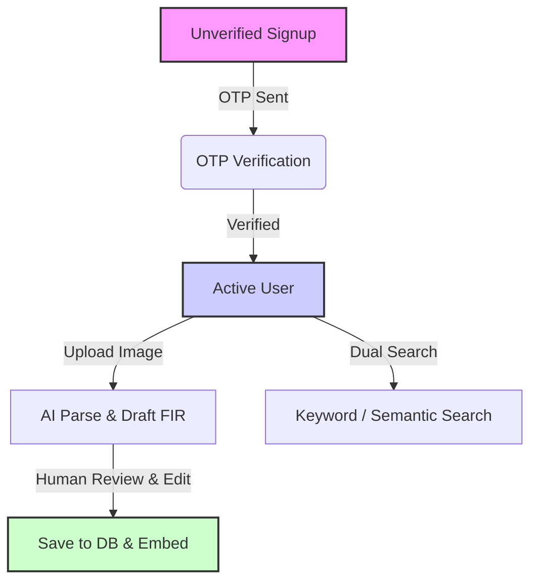

# Product Specification: ABHAY

**ABHAY** (*AI-Based Helpdesk for Assistance & Your Complaints*) is an AI-driven complaints management platform designed to streamline the process of filing, parsing, and reviewing Police Complaints / First Information Reports (FIR). 

By leveraging advanced multimodal AI, ABHAY converts complex, messy complaint descriptions or handwritten/printed complaint images into structured FIR drafts, ready for human verification and official entry.

---

## 1. Product Vision & Goals

- **Efficiency**: Minimize manual typing and administrative overhead in logging complaints.
- **Accuracy**: Assist users and admin reviews with automated suggestions of relevant Indian Penal Code (IPC) sections.
- **Searchability**: Provide standard keyword searches along with semantic search capability to discover related incidents and patterns.
- **Control**: Maintain a human-in-the-loop validation model, ensuring no AI outputs are saved as official complaints without human correction and approval.
- **Fair Use**: Prevent abuse through strict lifetime upload and AI search limits, managed dynamically by administrators.

---

## 2. Target Users & Personas

### A. The Complainant (Citizen / User)
- **Goal**: Quickly file a complaint with minimal technical friction, either by typing details or uploading an image of a handwritten/printed complaint.
- **Behavior**: Standard citizen who requires clear guidelines, real-time limit feedback, and status tracking of their submitted complaints.
- **Usage Limits**: Starts with a lifetime limit of **5 image uploads** and **10 AI searches**.

### B. The Human Reviewer / Admin (Police Officer / Administrator)
- **Goal**: Review parsed complaints, correct any inaccuracies introduced by AI, assign or adjust suggested IPC sections, and manage user limits.
- **Behavior**: An elevated user who needs a clear, tabular view of all system complaints, capability to search users by name or email, and controls to raise usage limits for specific accounts.

---

## 3. Core Product Workflows

### 3.1 Authentication & Registration Flow
1. **User Sign Up**: User registers using name, email, and password. 
2. **OTP Generation**: A 6-digit verification code with a **5-minute TTL** is generated, hashed with **bcrypt**, and sent via email (powered by Resend).
3. **Verification Page**: User must input the 6-digit OTP. The account remains blocked (`verified: false`) until correct OTP is verified.
4. **Login**: JWT cookie-based session (`authorization=<jwt>`, HTTP-Only, Secure, SameSite=None) is established upon successful authentication.
5. **Forgot/Reset Password**: Triggers a similar OTP verification flow with the purpose `reset` before allowing a password update.

### 3.2 Complaint Filing (Multimodal Parsing)
1. **Upload**: The user uploads an image of a complaint (e.g., photo of a printed letter, handwritten note, or formal complaint document).
2. **Image Validation**: Checks if the user has remaining uploads (`uploads_used < upload_limit`).
3. **AI Extraction**: Image is parsed using `gpt-5.4-mini` via the Responses API. The AI extracts the incident details and outputs structured text.
4. **Draft Generation**: The AI constructs:
   - A short action-phrase title (strictly $\le$ 12 characters).
   - The **7 core FIR fields**.
   - Proposed IPC section tags.
5. **Human Review**: The user reviews the parsed data side-by-side with the original image, makes corrections in the input fields, adds/removes IPC section tags, and clicks "Submit".
6. **Persistence & Vectorization**: 
   - Original image is stored in Supabase Storage.
   - Complaint fields are saved to the PostgreSQL database.
   - A 1536-dimensional vector embedding of `(description + IPC)` is generated using `text-embedding-3-small` and saved in `complaint_embeddings`.

### 3.3 Search & Retrieval
1. **Keyword Search (Default)**: Normal case-insensitive search (`ILIKE '%q%'`) matching on complaint titles or descriptions.
2. **Semantic AI Search (Toggle-based)**:
   - User toggles the "AI Semantic Search" switch (Default: **OFF**).
   - Generates embedding for the query.
   - Performs a cosine similarity search on the `complaint_embeddings` table.
   - **Cost**: Deducts **1 AI search credit** from the user's limit (`searches_used` is incremented upon success, even if 0 results are returned).
   - If the user has exhausted their limits, the semantic search is blocked with a `403 Forbidden` response.

### 3.4 Admin Control Panel
- **Complaint Overview**: Admins can view and search all complaints submitted by all users.
- **User Lookup**: Search for registered users by name or email.
- **Limit Adjustment**: View user details, including `uploads_used`, `searches_used`, `upload_limit`, and `search_limit`. Admin can update the limits to new absolute values (e.g., raising upload limit from 5 to 10).

---

## 4. The 7-Field Boiled-Down FIR Format

Each complaint must conform to the standard structured FIR format:

| Field Name | Type | Description |
| :--- | :--- | :--- |
| **Complainant Name** | String | Full name of the person lodging the complaint. |
| **Complainant Contact/Address** | Text | Email, phone number, and physical address of the complainant. |
| **Date & Time of Incident** | DateTime | When the alleged incident took place. |
| **Place of Incident (District/PS)** | String | Location detail, specifically including the police district or police station (PS) jurisdiction. |
| **Accused/Suspect Details** | Text | Name, description, or identity details of the accused person(s) or suspects (if unknown, listed as "Unknown"). |
| **Complaint Description** | Text | Chronological description of what transpired. |
| **IPC Sections** | String Array | List of applicable Indian Penal Code sections (e.g., `["IPC 379", "IPC 420"]`). |

---

## 5. UI & UX Guidelines

- **Visual Style**: Clean, modern, high-contrast. Minimal grey scale layout. **No blue buttons**; use neutral dark/light slate/grey shades. No "futuristic AI" aesthetics. Focus on readability, high accessibility, and clean borders.
- **Sidebar Navigation**:
  - **Logo**: ABHAY
  - **Nav Links**: Home (Upload/Draft) | Complaints (Table) | Profile | Settings | Logout
  - **Footer Indicator**: A user/admin profile chip showing remaining credits: `Uploads: {used}/{limit} | AI Searches: {used}/{limit}`.
- **Forms & Inputs**: Built using standard HTML inputs styled with Tailwind. Includes validation states, tooltips for limits, and clear warning states.
- **Autosave Protection**: In-progress review drafts are backed up to local storage so users don't lose typed corrections if the page reloads.

---

## 6. Functional Limits & Error Handling

- **Limit Enforcement**: Limit verification happens both client-side (disabling buttons, displaying warning alerts) and server-side (returning `403 Forbidden` with a standardized fail envelope).
- **Graceful Failures**: If the Resend API or OpenAI API fails, the application returns descriptive errors to the client rather than crashing or hanging indefinitely.
